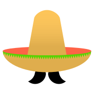

# Compadre
<a href="https://renecutura.eu/compadre"></a>

## Abstract
We propose Compadre, a tool for visual analysis for comparing distances of high-dimensional (HD) data and their low-dimensional projections. At the heart is a matrix visualization to represent the discrepancy between distance matrices, linked side-by-side with 2D scatterplot projections of the data. Using different examples
and datasets, we illustrate how this approach fosters (1) evaluating dimensionality reduction techniques w.r.t. how well they project the HD data, (2) comparing them to each other side-by-side, and (3) evaluate important data features through subspace comparison. We also present a case study, in which we analyze IEEE VIS authors from 1990 to 2018, and gain new insights on the relationships between coauthors, citations, and keywords. The coauthors are projected as accurately with UMAP as with t-SNE but the projections show different insights. The structure of the citation subspace is very different from the coauthor subspace. The keyword subspace is noisy yet consistent among the three IEEE VIS sub-conferences.

```
@inproceedings{cutura2020compadre,
  title={{C}omparing and {E}xploring {H}igh-{D}imensional {D}ata with {D}imensionality {R}eduction {A}lgorithms and {M}atrix {V}isualizations},
  author={Cutura, Rene and Aupetit, Micha{\"e}l and Fekete, Jean-Daniel and Sedlmair, Michael},
  booktitle={AVI'20-International Conference on Advanced Visual Interfaces},
  year={2020}
}
```

<br />

## Project setup
```
npm install
```

### Compiles and hot-reloads for development
```
npm run serve
```

### Compiles and minifies for production
```
npm run build
```

### Customize configuration
See [Configuration Reference](https://cli.vuejs.org/config/).
